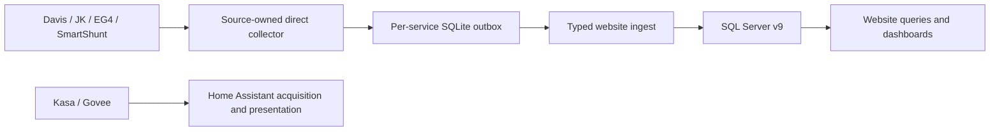

# Current architecture

Source baseline: 2026-10-04. This is an ownership and data-flow reference. Detailed
protocols, configuration and recovery belong to linked owners; GitHub issues own
the status of proposed work.

## Runtime and source authority

| Unit | Current responsibility | Canonical owner |
|---|---|---|
| Website on hvo-docker | Interactive UI, Entra browser auth, scoped ingest/read keys and SQL persistence | [website](../src/HVO.WebSite.v9/README.md), [deployment](../deploy/hvo-docker/README.md) |
| Davis | TCP LOOP/archive acquisition, local station state and durable delivery | [Davis manual](gateways/davis-vantage-pro2/README.md) |
| JK BMS | Persistent BLE sessions, complete readings and bounded HA presentation | [JK manual](gateways/jk-bms.md) |
| EG4 | Read-only USB HID/serial inverter/MPPT acquisition | [EG4 manual](gateways/eg4/deployment-and-shadow-validation.md) |
| SmartShunt | Paired public-GATT summary/detail observations | [SmartShunt manual](gateways/victron-smartshunt.md) |
| Home Assistant | Native Kasa/Govee acquisition and presentation | [HA operations](../deploy/home-assistant/README.md) |
| HA exporter | Implemented allowlisted bridge; disabled, unmapped, no production source claims | [exporter](../src/HVO.Edge.Exporter.HomeAssistant/README.md) |

Each direct collector is the sole current HVO writer for its approved source.
The exporter is a future alternate authority, not a duplicate writer. Cutover
follows [exactly-one-writer and quiescent rollback](gateways/sqlite-backup-and-rollback.md).
Outboxes provide transport retry, not indefinite chart history. OTLP operational
logs/traces/metrics are separate from observations. Gateways emit structured
stdout/stderr and optional OTLP, not application-owned log files.

Kasa/Govee have no active canonical HVO writer. Govee H5074/H5075 uses the temporary
isolated `hci1` HA bridge; permanent proxy/RF placement, H5179 and fallback credential
cleanup remain [#385](https://github.com/HualapaiValley/HVO.WebSite/issues/385).
JK/SmartShunt retain direct GATT ownership. Retired SolarAssistant/Kasa collectors
are not deployment choices; [history](PROJECT_HISTORY.md) retains archive evidence.

## Shared code ownership

| Project | Role and dependencies |
|---|---|
| [Contracts](../src/HVO.Edge.Contracts/README.md) | Typed envelopes, weather/power payloads and diagnostics; no process configuration |
| [Outbox](../src/HVO.Edge.Outbox/README.md) | Contracts plus EF/SQLite durability, initializer, retry/compaction and diagnostics |
| [Hosting](../src/HVO.Edge.Hosting/README.md) | Contracts/Outbox plus mounted config/secrets, identity, resilient HTTP, logging/OTLP and endpoints |
| [HA MQTT](../src/HVO.Edge.HomeAssistant.Mqtt/README.md) | Hosting plus MQTTnet current-state/discovery and registered command routing |
| [DataModels](../src/HVO.DataModels/README.md) | SQL Server EF entities, legacy dbo compatibility and authoritative v9 migrations |
| [Staging](../src/HVO.Staging/README.md) | Astronomy/weather package bridge; Davis production moon projection consumes it |
| [Themes](../src/HVO.WebSite.Themes/README.md) | Shared static assets used by website and [ThemeSandbox](../src/HVO.ThemeSandbox/README.md) |

[All 32 projects](README.md#project-documentation-owners) includes 13 MSTest
assemblies, Hosting.TestHost fixture and four tools. Archived `HVO.Database.sqlproj`
is outside the solution, but its SQL files remain direct schema-test inputs.
EF migrations govern current schema changes.

## Website persistence and presentation

The website owns canonical writes and bounded reads through `HvoV9DbContext`.
Weather raw/full archive are distinct; BMS includes child cells/config/info/alarms;
power includes readings, energy, inverter detail, inventory/configuration, gateway
status and atomic SmartShunt summary/detail bundles. Entities/context/migrations
are [schema authority](../src/HVO.DataModels/README.md), not copied DDL.
Legacy `HvoDbContext` and stored-procedure reads remain compatible; new features
use v9. Existing aggregate entities do not prove complete rollup population.

The real host retains public/authenticated SSR and Entra policy. Routes owns
interactive shell callbacks; dashboard queries begin after interactive render.
Typed scoped operations keep DbContexts out of circuits, retain successful
sections on provider failure and serialize cancellable refresh/disposal.
[UTC history](development/power-history-utc.md) retains complete bounded windows
and explicit gaps. [Weather queries](development/canonical-weather-queries.md),
[retry durability](development/canonical-ingest-retries.md),
[observation identity](development/power-observation-identity.md) and
[ingest trust boundaries](development/ingest-trust-boundaries.md) own detailed
freshness/replay/source reservation/collation/proxy rules.

Browser auth uses Entra Admin/User roles; scoped ingest/read keys are hashed in
SQL. Raw keys remain runtime secrets. [Website configuration](../deploy/hvo-docker/README.md)
separates deployment shape, Key Vault and runtime SiteConfiguration.
Separate runtime/migration Entra identities remain an open modernization decision.

## Edge configuration and health

[Headless runtime](architecture/EDGE_VNEXT_RUNTIME.md) and
[data flows](architecture/EDGE_DATA_FLOWS.md) define dependencies, mounted
gateway.json, environment precedence and startup-only secret files. Secret mounts
are read-only; ingest/MQTT/vendor credentials are not ordinary settings.
[Materialization prerequisites and #437](development/key-vault-materialization.md)
remain visible; this documentation does not repair that runtime helper.

`/health/live` reports process liveness. `/health` and `/health/ready` evaluate
device/outbox snapshots; critical health returns 503. Protected
`/diagnostics/health`, `/diagnostics/outbox` and `/diagnostics/status` expose device
freshness, retries/forwarding and external-delivery state. Edge health is richer
than process liveness; central presentation can improve.
[Gateway standards](gateways/common-gateway-standards.md) own the contract.

## Capabilities and future decisions

The central cloud command inbox/poll/ack model is proposed, not a website control
API. JK already has a separate bounded secret-backed HA password operation:
registered non-retained PRESS, configured six ASCII digits, offline/busy/verified
guards, positive ACK and DeviceInfo password readback.
[JK lifecycle/safety](gateways/jk-bms.md) owns that exception; generic BMS control
and explicit settings queries are not implemented by these docs.
SmartShunt public paired GATT is current; private enrichment is
[historical research](archive/2026-05-25-smartshunt-plan.md).

The RabbitMQ/Service Bus/Functions POC was removed after deferral. Its proposed
schemas/layer responsibilities are preserved in [historical architecture](archive/2026-08-18-architecture-baseline.md).
Revival requires a scale/operational decision. ESPHome is a source-specific decoder
or HA proxy, not a transparent BLE adapter for arbitrary .NET clients.
[Open decisions](FUTURE_WORK.md) and [future candidates](gateways/future-integrations.md)
retain camera/NVR/PDU/roof/motion questions and safety boundaries.
[Tests](../tests/README.md) use owned fakes, loopback and disposable services;
live hardware and deployment remain separately authorized.
