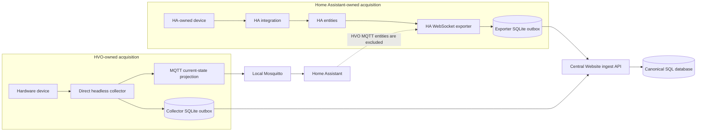
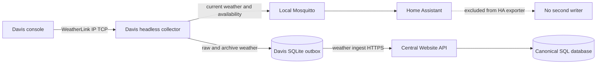
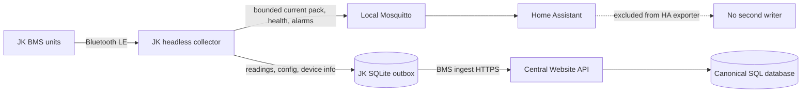
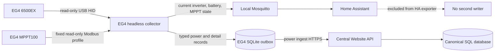
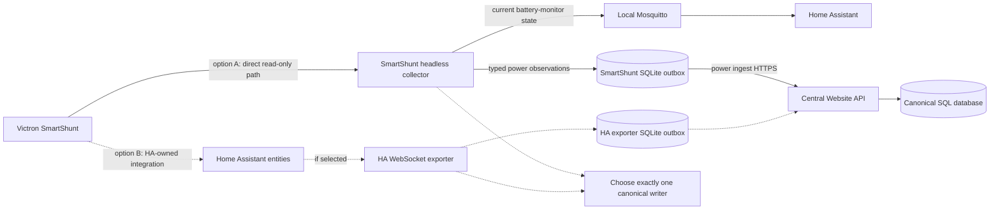
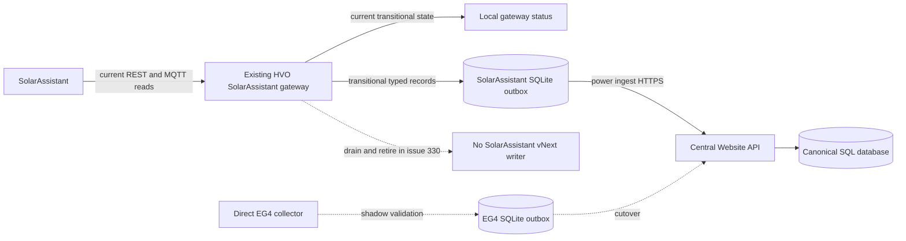
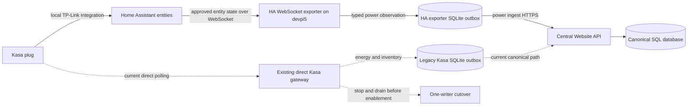

# Edge Data Flows

This document shows acquisition authority, current-state presentation, durable history, and the planned migration state for each HVO telemetry source.

## Reading The Diagrams

- **HVO-owned source:** a direct HVO collector owns acquisition and writes canonical history through its own SQLite outbox.
- **HA-owned source:** Home Assistant owns acquisition; the HA WebSocket exporter writes canonical history through the exporter's SQLite outbox.
- **MQTT projection:** current state for Home Assistant presentation only. It is not canonical historical delivery.
- **Website API:** the only path from edge services to the canonical SQL database. Edge services never connect directly to SQL.
- **Dashed path:** transitional, planned, or explicitly non-canonical.

Each SQLite outbox is independent. A Davis outage cannot block the JK BMS outbox, and an HA exporter outage cannot block direct collectors.

## System Overview

The exclusion on the final line prevents HA from sending Davis, JK BMS, EG4, or other HVO-owned MQTT state back through the exporter as a second canonical writer.

## Davis Vantage Pro 2

**Authority:** Direct Davis collector.

**Historical data:** raw and archive weather. Station settings and station information remain gateway-owned local state.

**HA presentation:** current weather and availability projected through MQTT.

**Migration status:** target headless port is issue #327. The direct collector remains the only canonical writer before and after migration.

## JK BMS

**Authority:** Direct JK BMS collector.

**Historical data:** pack readings, cell readings, alarms, configuration, and device information.

**HA presentation:** current battery state, health, alarms, and availability projected through MQTT.

**Migration status:** the issue #328 headless port is implemented. Production cutover still requires the documented bounded endurance check; the direct collector remains the only canonical writer throughout cutover.

## EG4 6500EX And MPPT100

**Authority:** Direct EG4 collector.

**Historical data:** inverter power, AC/load status, battery observations, internal MPPT details, external MPPT details, temperatures, and validated device diagnostics.

**HA presentation:** selected current inverter, battery, MPPT, and availability state projected through MQTT.

**Migration status:** target headless port is issue #324. Direct EG4 observations do not automatically replace JK BMS or SmartShunt authority for measurements taken at different physical points.

## Victron SmartShunt

**Authority:** Exactly one acquisition path must be selected by issue #326.

**Historical data:** bus voltage, current, power, state of charge, consumed amp-hours, remaining time, and device status supported by the selected read-only path.

**HA presentation:** selected current battery-monitor state and availability projected through MQTT when the direct HVO path is selected.

**Migration status:** issue #326 must select the authoritative path before deployment. The two paths must never run as simultaneous canonical writers.

## SolarAssistant

**Current authority:** Existing SolarAssistant gateway during transition.

**vNext authority:** No HVO vNext collector or canonical writer. Direct EG4 acquisition replaces overlapping observations only after shadow validation and cutover.

**Migration status:** the existing gateway remains operational during comparison. Issue #330 must drain and retire its canonical writer before overlapping direct EG4 streams are promoted.

## TP-Link Kasa

**Target authority:** Home Assistant TP-Link integration.

**Historical data:** approved per-device load power and optional voltage. Switch commands and command history are outside this design.

**HA presentation:** native HA entities from the TP-Link integration.

**Migration status:** target authority is defined, but the direct Kasa gateway remains the writer until issue #330 performs the stop, drain, source-claim transfer, and exporter enablement sequence.

## Govee Bluetooth Sensors

**Authority:** Home Assistant through an ESPHome Bluetooth proxy.

**Historical data:** approved temperature and humidity observations. Celsius values are normalized to Fahrenheit for the existing canonical weather contract.

**HA presentation:** native HA entities created by the Govee Bluetooth integration.

```mermaid
flowchart LR
    GOVEE[Govee BLE sensor] -->|Bluetooth advertisements| PROXY[ESPHome Bluetooth proxy]
    PROXY -->|Bluetooth proxy transport| HA[Home Assistant Govee entities]
    HA -->|approved entity state over WebSocket| EXP[HA WebSocket exporter on devpi5]
    EXP -->|typed weather observation| OUT[(HA exporter SQLite outbox)]
    OUT -->|weather ingest HTTPS| API[Central Website API]
    API --> DB[(Canonical SQL database)]
```

The Bluetooth proxy does not use MQTT for this path. Home Assistant owns the Govee entity state, and the exporter is its only canonical HVO writer.

## Authority And Outbox Matrix

| Source | Acquisition authority | Canonical writer | Durable outbox | HA current-state path |
|---|---|---|---|---|
| Davis | Direct HVO collector | Davis collector | Davis SQLite | Collector -> MQTT -> HA |
| JK BMS | Direct HVO collector | JK collector | JK SQLite | Collector -> MQTT -> HA |
| EG4 | Direct HVO collector | EG4 collector | EG4 SQLite | Collector -> MQTT -> HA |
| SmartShunt | Issue #326 selection | Selected direct collector or HA exporter | Selected path's SQLite | Collector -> MQTT -> HA when HVO-owned; native HA entity when HA-owned |
| SolarAssistant | Transitional legacy gateway | None in target vNext | Transitional SolarAssistant SQLite | Transitional only |
| Kasa | Home Assistant | HA WebSocket exporter | Exporter SQLite | Native HA integration |
| Govee | Home Assistant | HA WebSocket exporter | Exporter SQLite | Native HA integration through BT proxy |

## Failure Boundaries

- MQTT or Home Assistant failure does not stop direct collectors from committing to their own outboxes.
- Central API failure causes each outbox to accumulate independently and drain after recovery.
- HA failure pauses Kasa and Govee acquisition because HA owns those sources; the exporter does not query Recorder to reconstruct missed history.
- Exporter failure does not affect Davis, JK BMS, EG4, or other direct collectors.
- A source-authority cutover is incomplete until the old writer is stopped, its outbox is drained, and central source claims belong only to the new writer.

## Related Documents

- [Edge vNext Runtime](EDGE_VNEXT_RUNTIME.md)
- [Home Assistant Telemetry Exporter](HA_TELEMETRY_EXPORTER.md)
- [Gateway Standards](../gateways/common-gateway-standards.md)
- [EG4 Shadow Validation](../gateways/eg4/deployment-and-shadow-validation.md)
