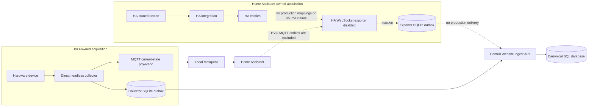
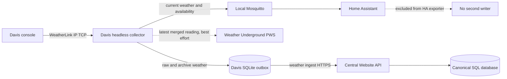
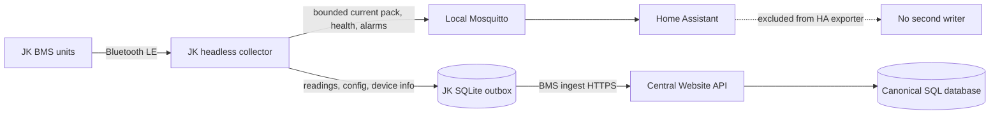
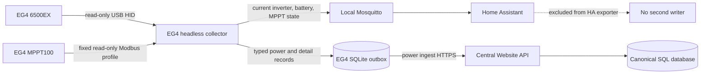
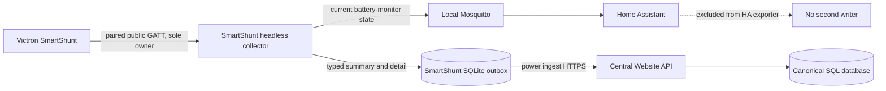
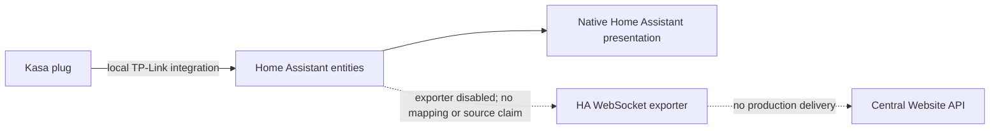
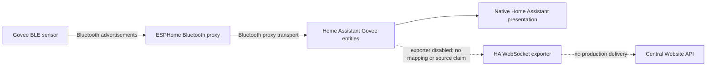

# Edge Data Flows

This document shows current production acquisition authority, current-state presentation, and durable history for each HVO telemetry source.

## Reading The Diagrams

- **HVO-owned source:** a direct HVO collector owns acquisition and writes canonical history through its own SQLite outbox.
- **HA-owned source:** Home Assistant owns acquisition and presentation. The HA WebSocket exporter can write approved canonical history, but it is intentionally disabled in production with no mappings or source claims.
- **MQTT projection:** current state for Home Assistant presentation only. It is not canonical historical delivery.
- **Website API:** the only path from edge services to the canonical SQL database. Edge services never connect directly to SQL.
- **Dashed path:** transitional, planned, or explicitly non-canonical.

Each active collector SQLite outbox is independent. A Davis outage cannot block the JK BMS outbox. The disabled HA exporter has no active production outbox flow.

## System Overview

If the exporter is enabled in the future, the exclusion on the final line prevents HA from sending Davis, JK BMS, EG4, or other HVO-owned MQTT state back through it as a second canonical writer.

## Davis Vantage Pro 2

**Authority:** Direct Davis collector.

**Historical data:** raw and archive weather. Station settings and station information remain gateway-owned local state.

**HA presentation:** current weather and availability projected through MQTT.

Weather Underground is disabled by default. When explicitly enabled, it receives the latest eligible merged LOOP observation every five seconds without another console poll. This projection has no outbox and no replay: failure is isolated, recovery sends the latest reading, and the central website remains the only canonical historical path. The upload uses the station key, not the unrelated Weather Underground query API key. See [Weather Underground Publication](../gateways/davis-vantage-pro2/weather-underground-deployment.md).

**Migration status:** the Davis slice of issue #330 is cut over to the headless collector. The legacy collector is stopped, the vNext collector is the sole WeatherLink owner and canonical writer, and the verified legacy image/volume backup remains available for ordered rollback. See [Davis vNext Cutover And Rollback](../gateways/davis-vantage-pro2/cutover-and-rollback.md).

## JK BMS

**Authority:** Direct JK BMS collector.

**Historical data:** pack readings, cell readings, alarms, configuration, and device information.

**HA presentation:** current battery state, health, alarms, and availability projected through MQTT.

**Migration status:** the issue #328 headless port is implemented and running as the direct production authority. Issue #356 expands the bounded MQTT presentation with pack power, cell-health aggregates, temperatures, capacity/health, balancing, charge/discharge state, alarms, and availability while keeping per-cell history in the canonical HVO path.

## EG4 6500EX And MPPT100

**Authority:** Direct EG4 collector.

**Historical data:** inverter power, AC/load status, battery observations, internal MPPT details, external MPPT details, temperatures, and validated device diagnostics.

**HA presentation:** selected current inverter, battery, MPPT, and availability state projected through MQTT.

**Migration status:** issue #354 cut production over to the headless collector while preserving the existing named outbox and direct-device authority. Home Assistant receives signed battery current/power, aggregate and per-tracker PV measurements, inverter AC/load/operating status, controller temperatures, and read-only diagnostics through MQTT Discovery. Direct EG4 observations do not replace JK BMS or SmartShunt authority for measurements taken at different physical points.

## Victron SmartShunt

**Authority:** Paired direct public-GATT SmartShunt collector. HA/ESPHome had no validated evidence for the required field set and is not an acquisition or enrichment path.

**Historical data:** bus voltage, current, power, state of charge, consumed amp-hours, remaining time, and device status supported by the selected read-only path.

**HA presentation:** selected current battery-monitor state and availability projected through MQTT when the direct HVO path is selected.

**Migration status:** issue #326 selected and implemented the direct authority. Production cutover must stop the legacy process before vNext starts; rollback must stop vNext before restoring the legacy process.

## Retired SolarAssistant Path

**Current authority:** None. There is no HVO SolarAssistant collector or canonical writer.

The direct SolarAssistant application, tests, deployment definition, container, and image were removed after direct EG4 became the production authority for the applicable physical observations. Historical SolarAssistant comparisons remain valid only as evidence used during EG4 shadow validation. The old SolarAssistant outbox and data-protection volumes remain preserved pending explicit disposition.

## TP-Link Kasa

**Authority:** Home Assistant TP-Link integration.

**Historical data:** approved per-device load power and optional voltage. Switch commands and command history are outside this design.

**HA presentation:** native HA entities from the TP-Link integration.

**Current status:** the direct Kasa application, tests, deployment definition, container, and image are removed. HA owns acquisition and presentation. The exporter is implemented but intentionally disabled, with no production Kasa mappings or source claims, so there is no active canonical HVO writer for Kasa.

## Govee Bluetooth Sensors

**Authority:** Home Assistant through an ESPHome Bluetooth proxy.

**Historical data:** approved temperature and humidity observations. Celsius values are normalized to Fahrenheit for the existing canonical weather contract.

**HA presentation:** native HA entities created by the Govee Bluetooth integration.

The Bluetooth proxy does not use MQTT for this path. Home Assistant owns Govee acquisition and presentation. The exporter is intentionally disabled with no production Govee mappings or source claims, so there is no active canonical HVO writer for Govee.

## Authority And Outbox Matrix

| Source | Acquisition authority | Canonical writer | Durable outbox | HA current-state path |
|---|---|---|---|---|
| Davis | Direct HVO collector | Davis collector | Davis SQLite | Collector -> MQTT -> HA |
| JK BMS | Direct HVO collector | JK collector | JK SQLite | Collector -> MQTT -> HA |
| EG4 | Direct HVO collector | EG4 collector | EG4 SQLite | Collector -> MQTT -> HA |
| SmartShunt | Direct HVO public-GATT collector | SmartShunt collector | SmartShunt SQLite | Collector -> MQTT -> HA |
| SolarAssistant | None; retired | None | Preserved legacy volumes pending disposition | None |
| Kasa | Home Assistant | None; exporter disabled | None active | Native HA integration |
| Govee | Home Assistant | None; exporter disabled | None active | Native HA integration through BT proxy |

## Home Assistant Power Semantics

Home Assistant power entities are current-state measurements, not an alternate canonical history path. Dashboards and helpers must preserve source and measurement-point meaning:

HVO MQTT Discovery includes source-resolution display precision for Davis, JK BMS, EG4, and SmartShunt measurements. This controls Home Assistant presentation only and never rounds the MQTT state or canonical history. Kasa and Govee precision remains owned by their native Home Assistant integrations; HVO does not create duplicate MQTT entities to override it.

| Source | Measurement point | Instantaneous sign | HA ownership/history rule |
|---|---|---|---|
| JK BMS | Individual battery bank | Positive charging, negative discharging | Direct JK collector owns acquisition/history; MQTT is presentation only. |
| SmartShunt | Whole DC bus | Positive charging, negative discharging | Direct SmartShunt collector owns acquisition/history; MQTT is presentation only. |
| EG4 6500EX | Inverter battery branch | Positive discharging, negative charging | Direct EG4 collector owns acquisition/history; do not sum it with whole-bus power. |
| EG4 MPPT100 | Charge-controller battery branch | Negative charging | Direct EG4 collector owns acquisition/history; PV input and battery output are different measurement points. |
| Kasa | Individual AC appliance load | Non-negative consumption | HA owns acquisition/presentation; no HVO history export is enabled. |

Never add JK bank totals, SmartShunt whole-bus power, EG4 branches, and Kasa appliance loads into one undifferentiated total. They overlap electrically and are sampled at different points and cadences. Home Assistant may derive presentation-only charge/discharge energy helpers from signed power, but helper output must not be exported as source-native HVO telemetry. Prefer source-native monotonic kWh counters, such as supported Kasa energy totals, when reset behavior and provenance are known.

## Failure Boundaries

- MQTT or Home Assistant failure does not stop direct collectors from committing to their own outboxes.
- Central API failure causes each outbox to accumulate independently and drain after recovery.
- HA failure pauses Kasa and Govee acquisition/presentation because HA owns those sources.
- The disabled exporter does not affect Davis, JK BMS, EG4, or SmartShunt direct collectors.
- Enabling any exporter mapping requires explicit approval, exact production source claims, and confirmation that no competing writer exists.

## Related Documents

- [Edge vNext Runtime](EDGE_VNEXT_RUNTIME.md)
- [Home Assistant Telemetry Exporter](HA_TELEMETRY_EXPORTER.md)
- [Gateway Standards](../gateways/common-gateway-standards.md)
- [EG4 Shadow Validation](../gateways/eg4/deployment-and-shadow-validation.md)
