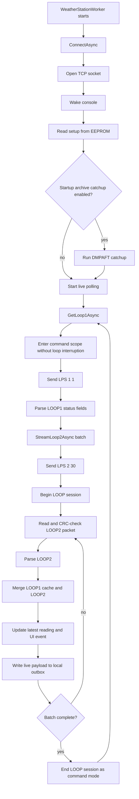
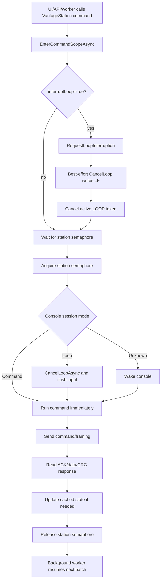
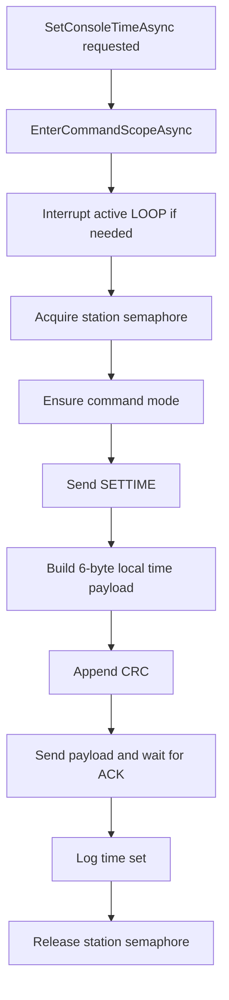
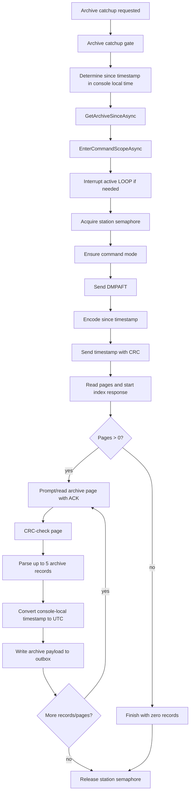

# Davis Vantage Pro2 HVO Implementation

This document describes how HVO implemented the Davis gateway. The vendor-defined protocol is documented separately in [manufacturer-protocol.md](manufacturer-protocol.md).

## Design Summary

HVO treats the Davis console as a local gateway source. The gateway streams live LOOP2 packets, periodically refreshes LOOP1-only fields, optionally catches up archive records with `DMPAFT`, stores readings in a local SQLite outbox, and forwards selected payloads to the website API.

Important design choices:

- LOOP2 is the main live source because it includes derived values and precision wind fields.
- LOOP1 is refreshed once per worker batch for console status, forecast, sunrise/sunset, monthly/yearly totals, and extra sensors.
- Archive records are handled separately because they are interval records, not live readings.
- Console writes exist in HVO code but must remain local-only unless a later safety design adds auth, confirmation, and audit controls.
- HVO currently exposes many values as `*F`, `*Mph`, and `*Inches`; this should be treated as HVO-normalized naming, not proof that display-unit settings are irrelevant.

## Implementation Decision Log

| Decision | Status | Rationale | Consequences / follow-up |
|----------|--------|-----------|--------------------------|
| Use LOOP2 as the primary live stream. | Accepted | LOOP2 includes derived values, precision wind fields, raw pressure, altimeter pressure, and rain windows needed by HVO. | Worker keeps a repeating `LPS 2 30` loop. |
| Refresh LOOP1 once per live batch. | Accepted | LOOP1 contains console battery, transmitter battery status, forecast, sunrise/sunset, monthly/yearly totals, and extra-sensor fields not present in LOOP2. | LOOP1 values can be slightly older than LOOP2 values. APIs should preserve source/freshness if needed. |
| Merge LOOP1 and LOOP2 into one HVO current reading model internally. | Accepted for current implementation | Simplifies local dashboard/current payloads. | Public API should still avoid hiding provenance where freshness matters. |
| Treat archive records as separate from live LOOP records. | Accepted | Archive records are interval/high/low/aggregate records; live LOOP records are instantaneous/current records. | Central storage may need separate archive payload/table. |
| Keep live rain fields semantically separate. | Accepted | Daily, storm, rate, 15-minute, hourly, 24-hour, monthly, yearly, and archive interval rain are not interchangeable. | Do not map live totals into generic `RainfallInches`. |
| Use rain bucket type, not rain display units, for rain conversion. | Accepted, pending live validation | Protocol and mature drivers treat bucket type as the conversion source. | Live-validate actual bucket type and display-unit independence. |
| Treat `*F`, `*Mph`, and `*Inches` names as HVO-normalized values. | Accepted as current behavior, needs redesign | Current code exposes normalized-unit property names. | Before API lock, separate raw/vendor values, normalized values, and display settings. |
| Serialize all console access through `VantageStation`. | Accepted | Davis console supports one active command/stream session; background LOOP and interactive commands must coordinate. | `SemaphoreSlim`, console mode tracking, and LOOP interruption are central implementation concepts. |
| Allow interactive commands to interrupt active LOOP streaming. | Accepted | UI/API operations should not wait for a full LOOP batch when command mode is needed. | Live polling may pause briefly; long archive downloads pause longer. |
| Keep write/destructive operations local-only until safety design exists. | Accepted | Time, EEPROM, alarm, barometer, archive interval, and archive clear can materially change console behavior. | Require local auth, confirmation, audit logging, read-back, and allowlist before broad UI exposure. |
| Use local SQLite outbox for store-and-forward. | Accepted | Keeps telemetry resilient to website/API outages. | Archive/live idempotency and payload versioning need final review. |
| Do not claim full Davis protocol coverage yet. | Accepted | Current implementation covers HVO's practical needs but official command-by-command coverage is not complete. | Complete command coverage table and test matrix first. |

## Project Layout

| Path | Purpose |
|------|---------|
| `src/HVO.Hardware.DavisVantagePro2/Protocol` | Low-level protocol constants, TCP client, CRC, exceptions, packet parsers. |
| `src/HVO.Hardware.DavisVantagePro2/Protocol/Packets` | `Loop2Packet` and `ArchiveRecord` parser/models. |
| `src/HVO.Hardware.DavisVantagePro2/Station` | `VantageStation` high-level station API. |
| `src/HVO.Hardware.DavisVantagePro2/Station/Models` | Station settings, info, calibration, alarm, transmitter, and diagnostic models. |
| `src/HVO.Hardware.DavisVantagePro2/Workers` | Background polling, archive catchup, and outbox forwarding. |
| `src/HVO.Hardware.DavisVantagePro2/Outbox` | Local SQLite outbox models/context. |
| `src/HVO.Hardware.DavisVantagePro2/Configuration` | Gateway options. |

## Main Classes And Interfaces

| Class/interface | Responsibility | Used by |
|-----------------|----------------|---------|
| `DavisProtocol` | Constants for control bytes, command names, packet sizes, bucket types, EEPROM addresses. | Protocol/client/parser/station code. |
| `DavisConsoleClient` | Low-level TCP wrapper for WeatherLink IP adapter and Davis command/data primitives. | `VantageStation`. |
| `CrcCalculator` | CRC-CCITT-16 compute, validate, and append helpers. | `DavisConsoleClient`, tests candidate. |
| `Loop2Packet` | Decoded LOOP1/LOOP2 packet model and parser. | `VantageStation`, worker, UI/API. |
| `ArchiveRecord` | Decoded 52-byte archive record model and parser. | `VantageStation`, archive catchup worker flow. |
| `VantageStation` | High-level serialized API over the Davis protocol. | Workers, local UI/API services. |
| `WeatherStationWorker` | Hosted service for connect/reconnect, LOOP polling, archive catchup, and outbox writes. | App host. |
| `OutboxForwarder` | Hosted service that forwards queued outbox records to the website API. | App host. |
| `StationSettings` | EEPROM-backed settings snapshot. | UI/API and `VantageStation` setup cache. |
| `StationInfo` | Hardware/firmware/time identity model. | UI/API. |
| `AlarmThresholds` | EEPROM-backed alarm threshold model. | UI/API and `VantageStation`. |

## Public Methods And Samples

### `VantageStation.ConnectAsync`

Purpose: opens TCP, wakes the console, and reads setup values from EEPROM if not already hydrated.

Side effects: opens network connection and populates cached settings such as rain bucket type and archive interval.

```csharp
await station.ConnectAsync(ct);
```

### `VantageStation.GetLoop1Async`

Purpose: requests one LOOP1 packet with `LPS 1 1`.

Side effects: none on console configuration.

```csharp
Loop2Packet loop1 = await station.GetLoop1Async(ct);
Console.WriteLine(loop1.ConsoleBatteryVoltage);
```

### `VantageStation.StreamLoop2Async`

Purpose: streams a requested number of LOOP2 packets with `LPS 2 <count>`.

Side effects: holds the station command lock while the stream is active.

```csharp
await foreach (Loop2Packet loop2 in station.StreamLoop2Async(30, ct))
{
    Console.WriteLine(loop2.OutsideTemperatureF);
}
```

### `VantageStation.GetCurrentConditionsAsync`

Purpose: reads alternating LOOP1/LOOP2 packets using `LPS 3 2`, then merges them into one HVO model.

Side effects: none on console configuration.

```csharp
Loop2Packet reading = await station.GetCurrentConditionsAsync(ct);
Console.WriteLine(reading.WindGust10MinMph);
```

### `VantageStation.GetArchiveSinceAsync`

Purpose: yields archive records after a console-local timestamp using `DMPAFT`.

Side effects: none on console configuration.

```csharp
await foreach (ArchiveRecord record in station.GetArchiveSinceAsync(sinceLocal, ct: ct))
{
    Console.WriteLine(record.RainInches);
}
```

### `VantageStation.GetStationInfoAsync`

Purpose: reads hardware type, model, firmware version/date, and console time.

```csharp
StationInfo info = await station.GetStationInfoAsync(ct);
Console.WriteLine(info.HardwareDescription);
```

### `VantageStation.GetStationSettingsAsync`

Purpose: reads EEPROM-backed station settings, including unit display bits, rain bucket type, archive interval, location, timezone, DST, and temperature logging mode.

```csharp
StationSettings settings = await station.GetStationSettingsAsync(ct);
Console.WriteLine(settings.RainBucketDescription);
```

### `VantageStation.SetArchiveIntervalAsync`

Purpose: changes the console archive interval using `SETPER`.

Allowed values in current HVO code: `1`, `5`, `10`, `15`, `30`, `60`, `120`.

Side effects: changes console logging behavior.

```csharp
await station.SetArchiveIntervalAsync(5, ct);
```

### `VantageStation.SetConsoleTimeAsync`

Purpose: sets the Davis console clock.

Side effects: changes archive timestamp basis. High caution.

```csharp
await station.SetConsoleTimeAsync(DateTime.Now, ct);
```

### `VantageStation.ClearArchiveAsync`

Purpose: clears console archive memory with `CLRLOG`.

Side effects: destructive. Must require explicit local confirmation and audit before any UI exposure.

```csharp
await station.ClearArchiveAsync(ct);
```

## Implemented Write Methods

These methods exist in HVO code and should be treated as local-only unless a later safety design says otherwise:

- `SetConsoleTimeAsync`
- `SetBarometerAsync`
- `SetArchiveIntervalAsync`
- `UpdateRainArchiveSettingsAsync`
- `SetLatitudeAsync`
- `SetLongitudeAsync`
- `SetAltitudeAsync`
- `UpdateLocationSettingsAsync`
- `SetRainBucketTypeAsync`
- `SetRainYearStartAsync`
- `SetDstAsync`
- `SetTimezoneCodeAsync`
- `SetTimezoneOffsetAsync`
- `SetTemperatureLoggingAsync`
- `SetCalibrationWindDirAsync`
- `SetCalibrationTempAsync`
- `SetCalibrationHumidityAsync`
- `SetTransmitterAsync`
- `SetRetransmitAsync`
- `SetAlarmThresholdsAsync`
- `ClearAlarmThresholdsAsync`
- `ClearActiveAlarmBitsAsync`
- `SetLampAsync`
- `ClearArchiveAsync`

## Worker Flow

1. `WeatherStationWorker` connects with `VantageStation.ConnectAsync`.
2. Optional startup archive catchup runs through `GetArchiveSinceAsync`.
3. Each live batch refreshes LOOP1 with `GetLoop1Async`.
4. The worker streams 30 LOOP2 packets with `StreamLoop2Async`.
5. Each LOOP2 packet is merged with the cached LOOP1 packet using `VantageStation.MergePackets`.
6. The merged reading is stored in the local outbox.
7. Failures increment consecutive error counters; repeated failures trigger reconnect with exponential backoff.

## Operation Flowcharts

### Background Read Loop



Key behavior:

- The worker normally keeps the console busy in repeating `LPS 2 30` batches.
- LOOP1 is refreshed before each LOOP2 batch so battery, forecast, sunrise/sunset, monthly/yearly totals, and extra-sensor fields stay reasonably fresh.
- Each LOOP2 packet is written to the outbox immediately after parsing and merging.
- A completed LOOP2 batch returns the console to command mode.

### Command Processing While The Worker Is Running



Examples that use this path:

- `SetConsoleTimeAsync`
- `SetArchiveIntervalAsync`
- `SetBarometerAsync`
- `GetStationSettingsAsync`
- `GetStationInfoAsync`
- `ClearArchiveAsync`

Important details:

- `VantageStation` serializes console access with a private `SemaphoreSlim`.
- Most interactive reads and writes use `EnterCommandScopeAsync` with `interruptLoop=true`.
- `GetLoop1Async` and `StreamLoop2Async` use `interruptLoop=false` because they are part of the worker's normal polling cadence.
- If a command arrives during an active LOOP session, HVO best-effort cancels the LOOP, cancels the linked LOOP token, waits for the station lock, ensures command mode, then sends the command.
- If command processing fails after console state becomes uncertain, the next reconnect/wake cycle should recover the session.

### Set Console Time Flow



Safety notes:

- This changes the console clock.
- Console clock changes affect archive timestamps and archive-to-UTC conversion.
- This should remain local-only and audited if exposed in UI.

### Archive Catchup Flow



Archive catchup notes:

- `WeatherStationWorker` uses `_archiveCatchupGate` so only one catchup runs at a time.
- `GetArchiveSinceAsync` holds the station semaphore while downloading pages.
- Archive records are interval records and are written as archive outbox entries.
- HVO has a `fallbackOnEmpty` option in `GetArchiveSinceAsync`, but startup catchup currently calls without enabling it.
- Long archive downloads can interrupt live LOOP polling because the Davis console only supports one active protocol session at a time.

## Implementation Caveats And Debt

| Caveat | Impact | Follow-up |
|--------|--------|-----------|
| HVO exposes many values as `*F`, `*Mph`, `*Inches`. | Public consumers can confuse protocol units, console display settings, and HVO-normalized units. | Fix local models/API to explicitly distinguish raw/vendor values, normalized values, and display preferences before locking APIs. |
| Parser currently does not vary temperature/wind/barometer by console display settings. | Expected to be correct per protocol, but must be live-validated. | Change console display units and confirm raw LOOP/archive bytes remain protocol-unit encoded. |
| Rain fields have different reset/window semantics. | Mapping them into one central `RainfallInches` field would be wrong. | Keep daily/rate/storm/rolling/archive interval fields separate. |
| Archive and live records are different shapes. | A single weather payload/table can lose semantics. | Decide whether archive records get a separate central contract/table. |
| `DMPAFT` fallback on zero pages is implemented but not used by startup catchup. | Some edge recoveries may miss oldest available records. | Decide whether startup catchup should enable `fallbackOnEmpty`. |

## Implementation Readiness Assessment

Current assessment: HVO has a good practical Davis implementation for live telemetry, archive catchup, core settings, diagnostics, and many write paths. It should not yet be described as a complete Davis protocol implementation until the official PDF is checked command-by-command and supported writes are validated against live hardware or a protocol simulator.

| Area | Current HVO status | Readiness | Next action |
|------|--------------------|-----------|-------------|
| TCP/WeatherLink IP transport | Implemented with wakeup, ACK prefix handling, send pacing, command mode tracking, LOOP interruption, and retries. | Good | Add simulator tests for ACK prefix, NAK/retry, timeout, and command-mode recovery. |
| CRC | Implemented. | Good | Add known-vector unit test for `0xCEC6 0x03A2 -> 0xE2B4` and packet-validity tests. |
| LOOP1/LOOP2 live parsing | Implemented for broad live/status field set. | Good | Add golden-packet unit tests covering dash/null sentinels, wind direction edge cases, and rain bucket conversions. |
| Archive parsing | Implemented for type B records and DMPAFT pages. | Good | Add golden-page simulator tests and timestamp conversion tests. |
| EEPROM settings reads | Implemented for key settings used by HVO. | Good for current needs | Compare against official PDF and decide whether additional EEPROM fields should be read or explicitly out of scope. |
| Diagnostics reads | `BARDATA`, `RXCHECK`, `RECEIVERS`, firmware/hardware reads implemented. | Good for current needs | Add simulator tests for text/binary response parsing. |
| Write operations | Many writes implemented. | Structurally good, not fully validated | Build a write-operation validation matrix before broad UI exposure. |
| Full Davis command coverage | Not proven. | Incomplete/unknown | Create command-by-command coverage table from official PDF. |
| Unit normalization | HVO-normalized properties exist, mostly Fahrenheit/mph/inches. | Needs cleanup before API lock | Define raw/vendor vs normalized vs display settings in local API and models. |
| Safety/audit around writes | Code paths exist; UI/safety design not complete. | Not production-exposure ready | Require local-only auth, confirmation, audit logs, and rollback/read-back strategy for risky writes. |

## Update Plan

1. Create a command coverage table in `manufacturer-protocol.md` with every official Davis command, current HVO support status, test status, and safety classification.
2. Add an HVO operation coverage table in this document for each public `VantageStation` method, including side effects, simulator-test status, and live-test status.
3. Add protocol simulator tests for `DavisConsoleClient` and `VantageStation` flows instead of relying only on mocked method calls.
4. Add golden-packet parser tests for LOOP1, LOOP2, archive record, archive page, CRC, sentinels, and rain bucket conversions.
5. Redesign local/API DTOs to separate vendor/raw fields, HVO-normalized fields, and console display settings before locking external contracts.
6. Validate all write paths on live hardware or explicitly mark unsupported/deferred.
7. Add safety gates for destructive or configuration-changing writes before UI exposure.
