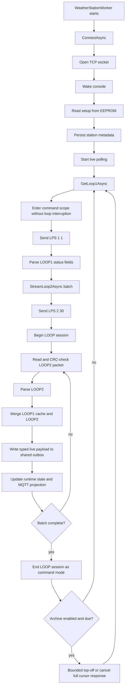
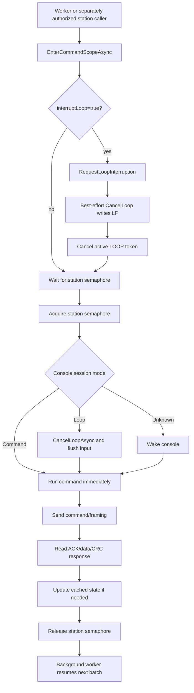
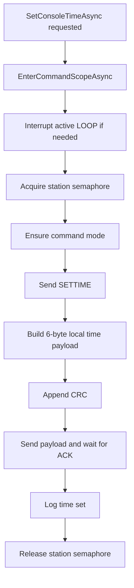
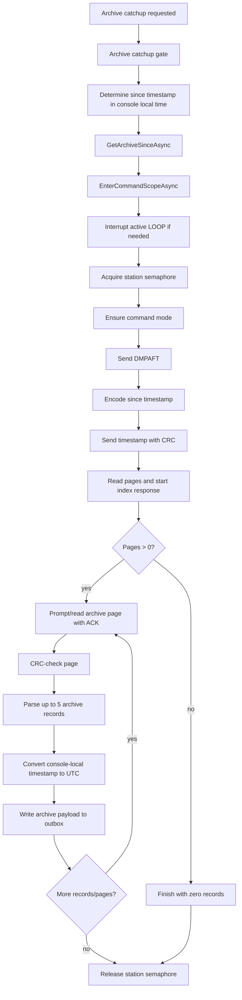

# Davis Vantage Pro2 HVO Implementation

This document describes the current headless Davis collector, inspected on 2026-10-04. The vendor-defined protocol is documented separately in [manufacturer-protocol.md](manufacturer-protocol.md); [console-fields-and-settings.md](console-fields-and-settings.md) extracts reusable facts from the complete [historical UI inventory](../../archive/2026-05-08-davis-console-inventory.md). Source inspection and prior evidence are not new live qualification.

## Design Summary

HVO treats the Davis console as a local gateway source. The gateway streams live LOOP2 packets, periodically refreshes LOOP1-only fields, optionally catches up archive records with `DMPAFT`, stores readings in a local SQLite outbox, and forwards selected payloads to the website API.

Important design choices:

- LOOP2 is the main live source because it includes derived values and precision wind fields.
- LOOP1 is refreshed once per worker batch for console status, forecast, sunrise/sunset, monthly/yearly totals, and extra sensors.
- Archive records are handled separately because they are interval records, not live readings.
- Selected console-write helpers exist at the protocol/station layer. The current host maps no console-write HTTP/MQTT path or management UI; broad exposure needs a separate safety/auth/confirmation/audit/readback design.
- Parser/outbox units remain explicit as `*F`, `*Mph`, `*Inches` and `*InHg`, independent of cached console display settings. The former display API/UI is removed.
- [Program.cs](../../../src/HVO.Hardware.DavisVantagePro2/Program.cs) composes Edge.Hosting, Edge.Outbox and optional Edge.HomeAssistant.Mqtt, migrates legacy local/outbox state before shared schema initialization, and maps only [shared health/diagnostics](hvo-api-contracts.md#current-local-endpoints).
- [DavisHomeAssistantProjection](../../../src/HVO.Hardware.DavisVantagePro2/HomeAssistant/DavisHomeAssistantProjection.cs) consumes Staging's `CelestialArcCalculations.BuildMoonSnapshot` in production. [#372](https://github.com/HualapaiValley/HVO.WebSite/issues/372) must migrate the actual consumer after the [SDK prerequisite](https://github.com/RoySalisbury/HVO.SDK/issues/82), not delete a supposedly test-only bridge.

## Implementation Decision Log

| Decision | Status | Rationale | Consequences / follow-up |
|----------|--------|-----------|--------------------------|
| Use LOOP2 as the primary live stream. | Accepted | LOOP2 includes derived values, precision wind fields, raw pressure, altimeter pressure, and rain windows needed by HVO. | Worker keeps a repeating `LPS 2 30` loop. |
| Refresh LOOP1 once per live batch. | Accepted | LOOP1 contains console battery, transmitter battery status, forecast, sunrise/sunset, monthly/yearly totals, and extra-sensor fields not present in LOOP2. | LOOP1 values can be slightly older than LOOP2 values. APIs should preserve source/freshness if needed. |
| Merge LOOP1 and LOOP2 into one HVO current reading model internally. | Implemented | Supplies durable live payloads and bounded MQTT presentation. | Cached LOOP1 can be older when a refresh fails; consumers must preserve freshness distinctions. |
| Treat archive records as separate from live LOOP records. | Implemented | Archive records are interval/high/low/aggregate records; live LOOP records are instantaneous/current records. | Separate typed payload, endpoint and `WeatherArchive` entity already exist. |
| Keep live rain fields semantically separate. | Accepted | Daily, storm, rate, 15-minute, hourly, 24-hour, monthly, yearly, and archive interval rain are not interchangeable. | Do not map live totals into generic `RainfallInches`. |
| Use rain bucket type, not rain display units, for rain conversion. | Accepted, pending live validation | Protocol and mature drivers treat bucket type as the conversion source. | Live-validate actual bucket type and display-unit independence. |
| Treat `*F`, `*Mph`, and `*Inches` names as HVO-normalized values. | Current typed contract | Parser/outbox code exposes explicit units; no current display API. | Any future presentation must separate vendor measurements, display preferences and calculations. |
| Serialize all console access through `VantageStation`. | Accepted | Davis console supports one active command/stream session; background LOOP and interactive commands must coordinate. | `SemaphoreSlim`, console mode tracking, and LOOP interruption are central implementation concepts. |
| Allow station commands to interrupt active LOOP streaming. | Low-level implementation | Serialized station reads/writes may need command mode without waiting for an entire batch. | No current UI/API caller; long archive reads still affect live freshness. |
| Keep write/destructive operations local-only until safety design exists. | Accepted | Time, EEPROM, alarm, barometer, archive interval, and archive clear can materially change console behavior. | Require local auth, confirmation, audit logging, read-back, and allowlist before broad UI exposure. |
| Use shared SQLite outbox for store-and-forward. | Implemented | Keeps telemetry resilient to website/API outages. | Typed v1 live/archive lanes deduplicate by source/time/type; central response accounting is strict. |
| Do not claim full Davis protocol implementation yet. | Accepted | The official command summary is covered in docs, but many commands are intentionally unsupported/deferred and some field-level tables still need deeper review. | Keep support status explicit and add tests before supporting any deferred command. |

## Project Layout

| Path | Purpose |
|------|---------|
| `src/HVO.Hardware.DavisVantagePro2/Protocol` | Low-level protocol constants, TCP client, CRC, exceptions, packet parsers. |
| `src/HVO.Hardware.DavisVantagePro2/Protocol/Packets` | `Loop2Packet` and `ArchiveRecord` parser/models. |
| `src/HVO.Hardware.DavisVantagePro2/Station` | `VantageStation` high-level station API. |
| `src/HVO.Hardware.DavisVantagePro2/Station/Models` | Station settings, info, calibration, alarm, transmitter, and diagnostic models. |
| [Workers](../../../src/HVO.Hardware.DavisVantagePro2/Workers) | Live polling, optional bounded archive top-off and runtime state. |
| [Outbox](../../../src/HVO.Hardware.DavisVantagePro2/Outbox) | Local settings/info/cursor store, legacy migration, typed writer/sender and retry requeue; shared Edge.Outbox owns the durable queue. |
| [Hosting](../../../src/HVO.Hardware.DavisVantagePro2/Hosting) | Collector registration, startup credential/options checks and ordered migration. |
| [HomeAssistant](../../../src/HVO.Hardware.DavisVantagePro2/HomeAssistant) | Bounded current presentation and staged celestial calculations. |
| `src/HVO.Hardware.DavisVantagePro2/Configuration` | Gateway options. |

## Main Classes And Interfaces

| Class/interface | Responsibility | Used by |
|-----------------|----------------|---------|
| `DavisProtocol` | Constants for control bytes, command names, packet sizes, bucket types, EEPROM addresses. | Protocol/client/parser/station code. |
| `DavisConsoleClient` | Low-level TCP wrapper for WeatherLink IP adapter and Davis command/data primitives. | `VantageStation`. |
| `CrcCalculator` | CRC-CCITT-16 compute, validate, and append helpers. | `DavisConsoleClient` and [parser tests](../../../tests/HVO.Hardware.DavisVantagePro2.Tests/Protocol/CrcCalculatorTests.cs). |
| `Loop2Packet` | Decoded LOOP1/LOOP2 packet model and parser. | `VantageStation`, worker and MQTT/publication projection. |
| `ArchiveRecord` | Decoded 52-byte archive record model and parser. | `VantageStation`, archive catchup worker flow. |
| `VantageStation` | High-level serialized API over the Davis protocol. | Collector worker and direct protocol/simulator tests. |
| `WeatherStationWorker` | Hosted service for connect/reconnect, LOOP polling, archive catchup, and outbox writes. | App host. |
| `DavisOutboxWriter`, `DavisOutboxBatchSender` | Typed live/archive enqueue and central partition/accounting. | Shared Edge.Outbox forwarder. |
| `StationSettings` | EEPROM-backed settings snapshot. | Durable local metadata, MQTT astronomy and `VantageStation` setup cache. |
| `StationInfo` | Hardware/firmware/time identity model. | Durable local metadata and station interrogation. |
| `AlarmThresholds` | EEPROM-backed alarm threshold model. | Low-level `VantageStation` methods/tests; no current alarm UI or notification-history service. |

## Low-level methods and illustrative samples

These are library usage examples, not host endpoints or authorized maintenance instructions. Read samples contact the configured console; write/destructive examples require separate operator authority and a controlled recovery plan. Routine documentation validation runs none of them.

### `VantageStation.ConnectAsync`

Purpose: opens TCP, wakes the console, and reads setup values from EEPROM if not already hydrated.

Side effects: opens network connection and populates cached settings such as rain bucket type and archive interval.

```csharp
await station.ConnectAsync(ct);
```

### `VantageStation.GetLoop1Async`

Purpose: requests one LOOP1 packet with `LPS 1 1`.

Side effects: none on console configuration.

```csharp
Loop2Packet loop1 = await station.GetLoop1Async(ct);
Console.WriteLine(loop1.ConsoleBatteryVoltage);
```

### `VantageStation.StreamLoop2Async`

Purpose: streams a requested number of LOOP2 packets with `LPS 2 <count>`.

Side effects: holds the station command lock while the stream is active.

```csharp
await foreach (Loop2Packet loop2 in station.StreamLoop2Async(30, ct))
{
    Console.WriteLine(loop2.OutsideTemperatureF);
}
```

### `VantageStation.GetCurrentConditionsAsync`

Purpose: reads alternating LOOP1/LOOP2 packets using `LPS 3 2`, then merges them into one HVO model.

Side effects: none on console configuration.

```csharp
Loop2Packet reading = await station.GetCurrentConditionsAsync(ct);
Console.WriteLine(reading.WindGust10MinMph);
```

### `VantageStation.GetArchiveSinceAsync`

Purpose: yields archive records after a console-local timestamp using `DMPAFT`.

Side effects: none on console configuration.

```csharp
await foreach (ArchiveRecord record in station.GetArchiveSinceAsync(sinceLocal, ct: ct))
{
    Console.WriteLine(record.RainInches);
}
```

### `VantageStation.GetStationInfoAsync`

Purpose: reads hardware type, model, firmware version/date, and console time.

```csharp
StationInfo info = await station.GetStationInfoAsync(ct);
Console.WriteLine(info.HardwareDescription);
```

### `VantageStation.GetStationSettingsAsync`

Purpose: reads EEPROM-backed station settings, including unit display bits, rain bucket type, archive interval, location, timezone, DST, and temperature logging mode.

```csharp
StationSettings settings = await station.GetStationSettingsAsync(ct);
Console.WriteLine(settings.RainBucketDescription);
```

### `VantageStation.SetArchiveIntervalAsync`

Purpose: changes the console archive interval using `SETPER`.

Allowed values in current HVO code: `1`, `5`, `10`, `15`, `30`, `60`, `120`.

Side effects: changes console logging behavior.

```csharp
await station.SetArchiveIntervalAsync(5, ct);
```

### `VantageStation.SetConsoleTimeAsync`

Purpose: sets the Davis console clock.

Side effects: changes archive timestamp basis. High caution.

```csharp
await station.SetConsoleTimeAsync(DateTime.Now, ct);
```

### `VantageStation.ClearArchiveAsync`

Purpose: clears console archive memory with `CLRLOG`.

Side effects: destructive. Must require explicit local confirmation and audit before any UI exposure.

```csharp
await station.ClearArchiveAsync(ct);
```

## Implemented Write Methods

These methods exist in HVO code and should be treated as local-only unless a later safety design says otherwise:

- `SetConsoleTimeAsync`
- `SetBarometerAsync`
- `SetArchiveIntervalAsync`
- `UpdateRainArchiveSettingsAsync`
- `SetLatitudeAsync`
- `SetLongitudeAsync`
- `SetAltitudeAsync`
- `UpdateLocationSettingsAsync`
- `SetRainBucketTypeAsync`
- `SetRainYearStartAsync`
- `SetDstAsync`
- `SetTimezoneCodeAsync`
- `SetTimezoneOffsetAsync`
- `SetTemperatureLoggingAsync`
- `SetCalibrationWindDirAsync`
- `SetCalibrationTempAsync`
- `SetCalibrationHumidityAsync`
- `SetTransmitterAsync`
- `SetRetransmitAsync`
- `SetAlarmThresholdsAsync`
- `ClearAlarmThresholdsAsync`
- `ClearActiveAlarmBitsAsync`
- `SetLampAsync`
- `ClearArchiveAsync`

## Worker Flow

1. `WeatherStationWorker` connects with `VantageStation.ConnectAsync`.
2. Each live batch refreshes LOOP1 with `GetLoop1Async`.
3. The worker streams 30 LOOP2 packets with `StreamLoop2Async`.
4. Each LOOP2 packet is merged with the cached LOOP1 packet using `VantageStation.MergePackets`.
5. The merged reading is stored in the local outbox.
6. When explicitly enabled, periodic archive top-off runs between completed live batches.
7. Failures increment consecutive error counters; repeated failures trigger reconnect with exponential backoff.

## Operation Flowcharts

### Background Read Loop


```mermaid
flowchart TD
    A[WeatherStationWorker starts] --> B[ConnectAsync]
    B --> C[Open TCP socket]
    C --> D[Wake console]
    D --> E[Read setup from EEPROM]
    E --> F[Persist station metadata]
    F --> H[Start live polling]
    H --> I[GetLoop1Async]
    I --> J[Enter command scope without loop interruption]
    J --> K[Send LPS 1 1]
    K --> L[Parse LOOP1 status fields]
    L --> M[StreamLoop2Async batch]
    M --> N[Send LPS 2 30]
    N --> O[Begin LOOP session]
    O --> P[Read and CRC-check LOOP2 packet]
    P --> Q[Parse LOOP2]
    Q --> R[Merge LOOP1 cache and LOOP2]
    R --> T[Write typed live payload to shared outbox]
    T --> S[Update runtime state and MQTT projection]
    S --> U{Batch complete?}
    U -- no --> P
    U -- yes --> V[End LOOP session as command mode]
    V --> W{Archive enabled and due?}
    W -- yes --> X[Bounded top-off or cancel full cursor response]
    X --> I
    W -- no --> I
```

Key behavior:

- The worker normally keeps the console busy in repeating `LPS 2 30` batches.
- LOOP1 is refreshed before each LOOP2 batch so battery, forecast, sunrise/sunset, monthly/yearly totals, and extra-sensor fields stay reasonably fresh.
- Each LOOP2 packet is written to the outbox immediately after parsing and merging.
- A completed LOOP2 batch returns the console to command mode.
- Enabled/due archive top-off runs after that finite batch. Connect refreshes durable station metadata; it does not perform a separate pre-LOOP startup archive scan.

### Command Processing While The Worker Is Running


```mermaid
flowchart TD
    A[Worker or separately authorized station caller] --> B[EnterCommandScopeAsync]
    B --> C{interruptLoop=true?}
    C -- yes --> D[RequestLoopInterruption]
    C -- no --> G[Wait for station semaphore]
    D --> E[Best-effort CancelLoop writes LF]
    E --> F[Cancel active LOOP token]
    F --> G
    G --> H[Acquire station semaphore]
    H --> I{Console session mode}
    I -- Command --> J[Run command immediately]
    I -- Loop --> K[CancelLoopAsync and flush input]
    K --> J
    I -- Unknown --> L[Wake console]
    L --> J
    J --> M[Send command/framing]
    M --> N[Read ACK/data/CRC response]
    N --> O[Update cached state if needed]
    O --> P[Release station semaphore]
    P --> Q[Background worker resumes next batch]
```

Examples that use this path:

- `SetConsoleTimeAsync`
- `SetArchiveIntervalAsync`
- `SetBarometerAsync`
- `GetStationSettingsAsync`
- `GetStationInfoAsync`
- `ClearArchiveAsync`

Important details:

- `VantageStation` serializes console access with a private `SemaphoreSlim`.
- Most interactive reads and writes use `EnterCommandScopeAsync` with `interruptLoop=true`.
- `GetLoop1Async` and `StreamLoop2Async` use `interruptLoop=false` because they are part of the worker's normal polling cadence.
- If a command arrives during an active LOOP session, HVO best-effort cancels the LOOP, cancels the linked LOOP token, waits for the station lock, ensures command mode, then sends the command.
- If command processing fails after console state becomes uncertain, the next reconnect/wake cycle should recover the session.

### Set Console Time Flow


```mermaid
flowchart TD
    A[SetConsoleTimeAsync requested] --> B[EnterCommandScopeAsync]
    B --> C[Interrupt active LOOP if needed]
    C --> D[Acquire station semaphore]
    D --> E[Ensure command mode]
    E --> F[Send SETTIME]
    F --> G[Build 6-byte local time payload]
    G --> H[Append CRC]
    H --> I[Send payload and wait for ACK]
    I --> J[Log time set]
    J --> K[Release station semaphore]
```

Safety notes:

- This changes the console clock.
- Console clock changes affect archive timestamps and archive-to-UTC conversion.
- This should remain local-only and audited if exposed in UI.

### Archive Catchup Flow


```mermaid
flowchart TD
    A[Archive catchup requested] --> B[Archive catchup gate]
    B --> C[Determine since timestamp in console local time]
    C --> D[GetArchiveSinceAsync]
    D --> E[EnterCommandScopeAsync]
    E --> F[Interrupt active LOOP if needed]
    F --> G[Acquire station semaphore]
    G --> H[Ensure command mode]
    H --> I[Send DMPAFT]
    I --> J[Encode since timestamp]
    J --> K[Send timestamp with CRC]
    K --> L[Read pages and start index response]
    L --> M{Pages > 0?}
    M -- no --> N[Finish with zero records]
    M -- yes --> O[Prompt/read archive page with ACK]
    O --> P[CRC-check page]
    P --> Q[Parse up to 5 archive records]
    Q --> R[Convert console-local timestamp to UTC]
    R --> S[Write archive payload to outbox]
    S --> T{More records/pages?}
    T -- yes --> O
    T -- no --> U[Release station semaphore]
    N --> U
```

Archive catchup notes:

- `WeatherStationWorker` uses `_archiveCatchupGate` so only one catchup runs at a time.
- `GetArchiveSinceAsync` holds the station semaphore while downloading pages.
- Archive records are interval records and are written as archive outbox entries.
- Each top-off requests records after the exact durable console cursor and accepts at most 25 records so downstream persistence completes within the live freshness budget before LOOP polling resumes.
- This WeatherLink/console currently returns the documented 513-page full circular buffer for cursor-based requests. v1 cancels that response with `<ESC>` before requesting page one so live LOOP acquisition remains stable; bounded recovery is deferred to #346.
- Production v1 leaves `ArchiveCatchupMode` disabled until #346 is complete. Existing archive data and the durable cursor are preserved; live LOOP acquisition and canonical raw forwarding continue.
- Circular-buffer responses can begin before the requested window; stale leading records are skipped until the requested window is reached.
- A bounded archive exit uses the protocol-defined `<ESC>` byte; a 513-page cursor response is cancelled before page one.
- Dormant periodic catch-up calls `GetArchiveSinceAsync` with `fallbackOnEmpty`; v1 cancels any resulting 513-page response before page one.
- Long archive downloads can interrupt live LOOP polling because the Davis console only supports one active protocol session at a time.

## Implementation Caveats And Debt

| Caveat | Impact | Follow-up |
|--------|--------|-----------|
| HVO exposes many normalized values as `*F`, `*Mph`, `*Inches`. | Consumers can confuse protocol units and console display preferences. | Preserve explicit units; any future display API must define its conversion/provenance separately. |
| Parser intentionally does not vary temperature/wind/barometer by console display settings. | Expected to be protocol-compliant; the collector does not expose the former display API/UI. | Separately authorized live display-unit changes/raw-byte comparison remain uncompleted validation. |
| Rain fields have different reset/window semantics. | Mapping them into one central `RainfallInches` field would be wrong. | Keep daily/rate/storm/rolling/archive interval fields separate. |
| Archive and live records are different shapes. | Collapsing them would lose interval semantics. | Preserve the implemented separate payload/endpoint/entity and both archive timestamps. |
| `DMPAFT` can return zero pages or the 513-page full circular buffer for a cursor request. | Full-buffer scans interrupt live LOOP acquisition on the deployed adapter. | v1 cancels cursor-triggered full-buffer responses and leaves catch-up disabled; bounded recovery is deferred to #346. |

## Implementation Readiness Assessment

Current assessment: HVO has a good practical Davis implementation for live telemetry, core settings, diagnostics, and many write paths. Archive catch-up is disabled pending #346. It should not yet be described as a complete Davis protocol implementation until the official PDF is checked command-by-command and risky writes have read-back/safety design plus explicit live-validation decisions.

| Area | Current HVO status | Readiness | Next action |
|------|--------------------|-----------|-------------|
| TCP/WeatherLink IP transport | Implemented with wakeup, ACK prefix handling for command and CRC payload ACKs, send pacing, command mode tracking, LOOP interruption, and retries. | Good | Keep live stress tests manual because the WeatherLink/IP adapter can become unstable during repeated connect/stress cycles. |
| CRC | Implemented. | Good | Keep packet-validity and retry tests; re-check any external numeric reference vectors before documenting them. |
| LOOP1/LOOP2 live parsing | Implemented for broad live/status field set with parser tests for sentinels, wind edges, precision wind fields, and rain bucket conversions. | Good | Complete official field-by-field coverage review before claiming exhaustive protocol coverage. |
| Archive parsing | Implemented for type B records and DMPAFT pages with parser and fake-server coverage for current flows. | Good | Live-validate timestamp conversion across timezone/DST settings. |
| EEPROM settings reads | Implemented for key settings used by HVO. | Good for current needs | Compare against official PDF and decide whether additional EEPROM fields should be read or explicitly out of scope. |
| Diagnostics reads | `BARDATA`, `RXCHECK`, `RECEIVERS`, firmware/hardware reads implemented with fake-server coverage for text/binary response parsing. | Good for current needs | Keep live diagnostics read-only; treat repeated live suite instability as adapter limitation unless a cooldown/reset design is added. |
| Write operations | Many writes implemented with simulator coverage for current command/payload flows and CRC-protected payload retries. | Structurally good, not live-validated for risky writes | Add read-back verification and safety gates before broad UI exposure. |
| Full Davis command coverage | Command summary reviewed; many commands deferred. | Documented, not fully implemented | Keep unsupported/deferred commands explicit; do not claim full driver implementation. |
| Unit normalization | Explicit typed parser/outbox units; display conversion helpers remain without a UI/API. | Implemented contract with unresolved live display-unit qualification | Keep vendor/normalized/display distinctions explicit in any future presentation. |
| Safety/audit around writes | Code paths exist; UI/safety design not complete. | Not production-exposure ready | Require local-only auth, confirmation, audit logs, and rollback/read-back strategy for risky writes. |

## Update Plan

1. Maintain the command coverage table in `manufacturer-protocol.md` as support changes; it now covers the Rev 2.6.1 command summary extracted from the local PDF.
2. Add an HVO operation coverage table in this document for each public `VantageStation` method, including side effects, simulator-test status, and live-test status.
3. Continue extending protocol simulator tests for newly supported `DavisConsoleClient` and `VantageStation` flows; current core read/write flows have fake-server coverage.
4. Continue parser field review against the official PDF; current LOOP/archive tests cover core fields, sentinels, rain bucket conversions, wind edges, and CRC framing.
5. Any separately approved new display/API DTO must separate vendor/raw fields, normalized values and console display preferences; the former local API is not an active contract.
6. Validate risky write paths on live hardware only after read-back/safety design, or explicitly mark unsupported/deferred.
7. Add safety gates for destructive or configuration-changing writes before UI exposure.
